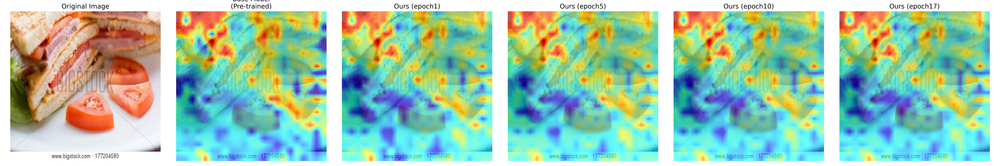
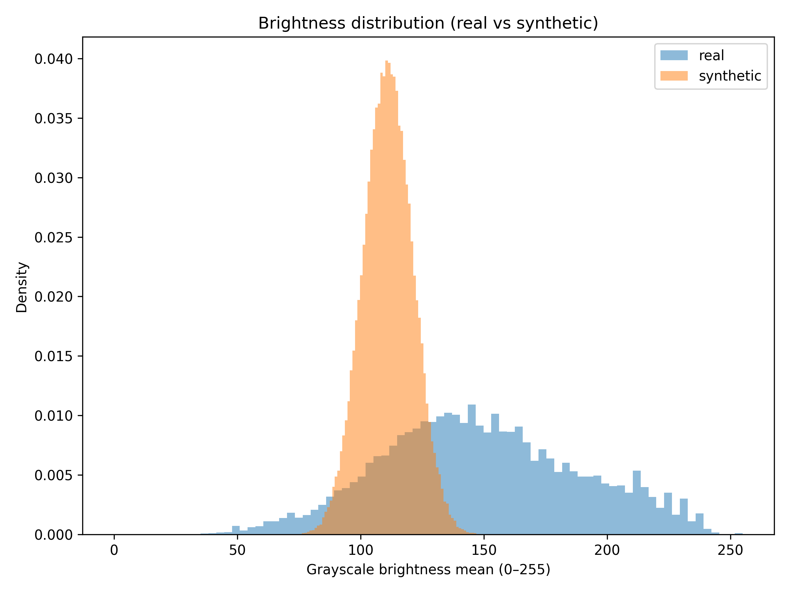
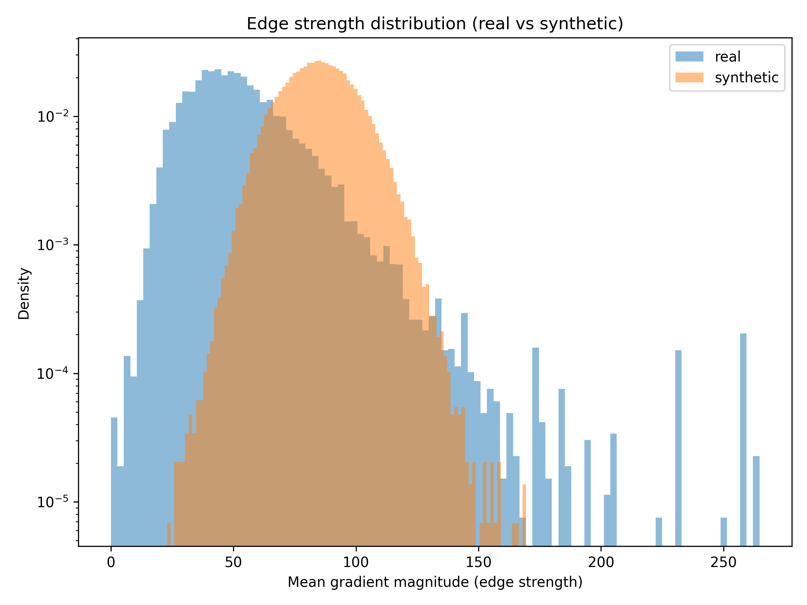
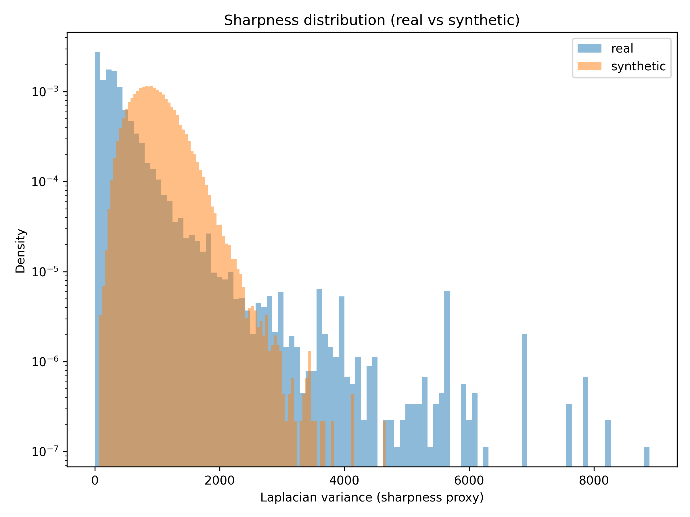
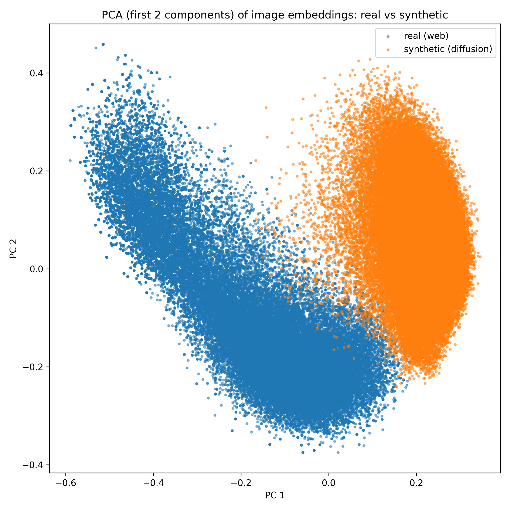
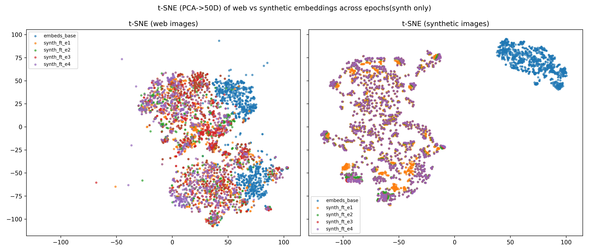
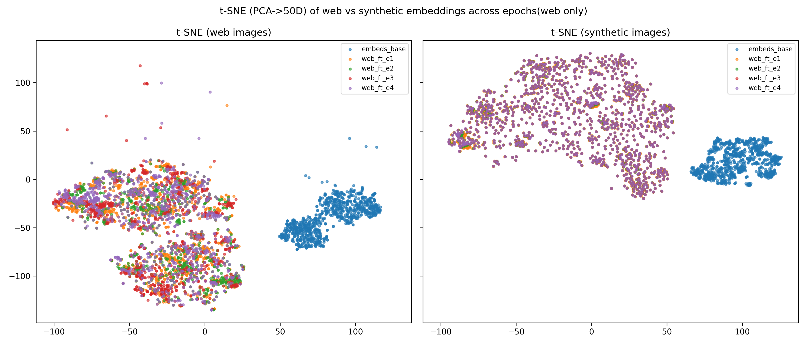

# What Makes Vision–Language Models Work for Domain-Specific Retrieval?

# Contributors
Yunqi Zhao*, Zhiheng Xian*, Liangzhao Chen*  
Department of Computer Science and Engineering, University of Michigan  
Contact: rickzhao@umich.edu, zhihengx@umich.edu, leonzc@umich.edu  

## Research Questions

For a Vision–Language Model (VLM), we ask:

1. **Which training data are actually effective for domain-specific retrieval?**  
   In particular, are real web images or diffusion-generated synthetic images more useful, once we account for distribution shifts, watermarks, and caption noise?  
   We study this by analyzing pixel-level statistics and SigLIP vision-encoder embedding distributions for real vs. synthetic food images.

2. **Which LoRA configurations work best for VLM adaptation in this domain?**  
   We systematically compare different LoRA placements and hyperparameters on SigLIP, including vision layers, projection heads, Q/V projections, and different ranks.

Our experiments show that **data choice** (real vs. synthetic, cleaned vs. noisy) and **LoRA configurations** (placement and rank/alpha) are both crucial for achieving strong retrieval performance in fine-grained food understanding.

---

# Key Findings

## 1. Data Matters — but Not in the Way We Expected

### **Watermarks have minimal impact on the SigLIP vision encoder**
Although watermarks are visually obvious to humans, the ViT-based vision tower remains robust:

- Attention maps show that SigLIP does **not** increasingly attend to watermark regions.
- Across epochs, the encoder consistently focuses on **semantic** food regions rather than artifacts.

---

### **Synthetic diffusion images are visually clean, but distributionally mismatched**

#### **1. Pixel-level statistics show clear real–synthetic shifts**
Synthetic images differ from real ones in brightness, average edge strength, and sharpness.

|  |  |  |
|---|---|---|

---

#### **2. Embedding-space analysis reveals strong domain separation**
Real and synthetic image embeddings form **distinct clusters**, before fine-tuning.

|  |  | 
|---|---|

---

#### **3. Fine-tuning aligns the encoder toward its training domain—but never bridges the gap**
Real-only and synthetic-only fine-tuning show:

- Real-trained models move toward the real embedding manifold.
- Synthetic-trained models move deeper into the synthetic manifold.
- **Neither closes the gap** between domains.

**Conclusion:**  
Real web images remain essential for strong real-world retrieval performance; synthetic diffusion images are **not** an effective substitute.

---

## 2. LoRA Configurations Matter — Structure Determines Effectiveness

### LoRA Configuration Summary

| Rank | Alpha | Vis. Layers | Txt. Layers | Heads Tuned | Modules                         | Score      |
|------|--------|-------------|-------------|-------------|----------------------------------|------------|
| 8    | 16     | 2           | 0           | yes         | q_proj, v_proj                   | 0.44042    |
| 8    | 16     | 2           | 0           | no          | q_proj, v_proj                   | 0.43121    |
| 16   | 32     | 4           | 0           | yes         | q_proj, v_proj                   | 0.43632    |
| 16   | 32     | 4           | 0           | yes         | q_proj, v_proj, k_proj, out_proj | 0.42521    |
| 16   | 32     | 2           | 0           | yes         | q_proj, v_proj                   | 0.44183    |
| 16   | 32     | 2           | 2           | yes         | q_proj, v_proj                   | 0.44124    |
| 32   | 32     | 2           | 0           | yes         | q_proj, v_proj                   | **0.44496** |
| 16   | 32     | 6           | 0           | yes         | q_proj, v_proj                   | 0.43237    |

### **Key observations**

- **Projection heads matter:**  
  Unfreezing both vision and text projection heads improves performance.

- **Selective LoRA injection is crucial:**  
  LoRA on **`q_proj` and `v_proj` only** performs best.  
  Including `k_proj` or `out_proj` **reduces** performance.

- **Text encoder tuning is unnecessary:**  
  Adding LoRA to the text tower slightly harms performance.

- **Rank–alpha scaling helps:**  
  A configuration such as **rank 32 / alpha 32** performs best.

- **Shallow vision tuning works best:**  
  Injecting LoRA only into the **last two** vision layers outperforms deeper injections.

- **Non-monotonic trends:**  
  The search space is only partially explored; additional configurations may yield better results.

---

# Summary

- **Real images** are indispensable for food-domain retrieval due to large visual and semantic distribution shifts in synthetic data.  
- **Targeted LoRA placement**—projection heads + Q/V projections + shallow vision-layer tuning—provides the strongest improvements.  
- Strong domain consistency and lightweight, well-placed adaptation are the two key levers for effectively adapting VLMs to specialized retrieval tasks.

---
## Repo Overview

This repository is organized as follows:

- `dishcovery-vlm-mtf-cvpr-2025`  
  Final results and scripts for all finetuning configurations on the CVPR MetaFood (Dishcovery) benchmark, including logs, metrics, and plotting utilities.

- `LoRA_Placement_study`  
  Experiments on **where** to apply LoRA in SigLIP (vision layers vs. text layers vs. projection heads vs. Q/V paths), plus training scripts and configs for different ranks/alphas.

- `Data_distribution_study`  
  Analysis of **real vs. synthetic** data distributions: pixel-level statistics, SigLIP embedding t-SNEs, training trajectories, and watermarked vs. cleaned subsets.

- `Data_processing`  
  Data preprocessing pipeline: caption cleaning (multilingual → English), Florence-2 watermark mask prediction, diffusion-based inpainting, and dataset preparation scripts.
